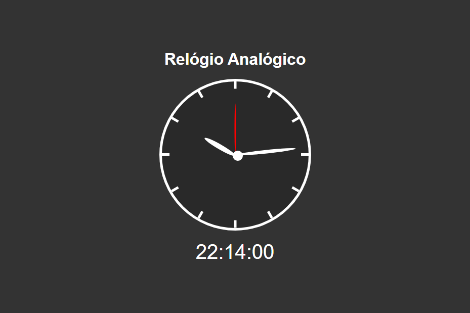

# Relogio
> site para estudo de javaScript

## Objetivo do projeto:
Estudar a manipulação de datas com Javascript

##

Projeto construído como exercício do curso da B7web
> finalizado

[Clique aqui para acessar](https://rafael-damasceno.github.io/Relogio/)

## Tecnologias:

- HTML
- CSS
- Git e Github
- JavaScript